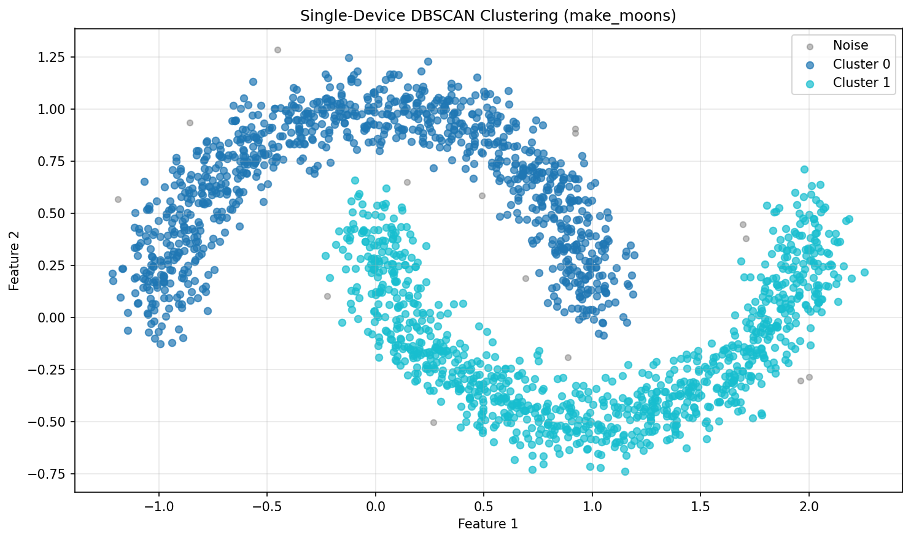
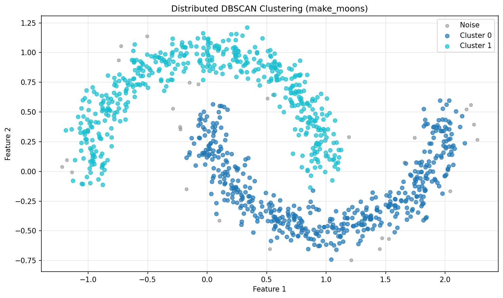

# dbscan-jax

A high-performance, distributed implementation of the DBSCAN clustering algorithm using JAX. This implementation adheres strictly to JAX/XLA functional programming paradigms and supports both single-device and multi-device distributed execution through a unified interface.

## Features

- **JAX-compatible implementation** using matrix-based label propagation
- **Single/Multi-device execution** with automatic sharding
- **JIT compilation** for optimal performance
- **Sequential label re-indexing** (optional)
- **GPU/TPU support** via JAX
- **Type-hinted API** for better IDE support

## Installation

```bash
# using uv
uv sync

# using pip
uv pip install -e .

# activate env
source .venv/bin/activate
```

## Quick Start

```python
import jax.numpy as jnp
from dbscan import JaxDBScan

# Prepare your data
X = jnp.array([[0, 0], [0.1, 0.1], [0, 0.1], [5, 5], [5.1, 5.1]])

# Initialize and fit the model
model = JaxDBScan(eps=0.5, min_pts=2)
labels = model.fit_predict(X)

print(labels)  # Output: [0, 0, 0, 1, 1] (or similar)
```

## Usage Examples

### Single-Device Execution

```python
import jax.numpy as jnp
from sklearn.datasets import make_moons
from dbscan import JaxDBScan

# Generate sample data
X_np, _ = make_moons(n_samples=2000, noise=0.1, random_state=42)
X = jnp.array(X_np)

# Initialize and run DBSCAN
model = JaxDBScan(eps=0.1, min_pts=5, use_distributed=False)
labels = model.fit_predict(X)

# Results
print(f"Clusters found: {len(set(labels)) - (1 if -1 in labels else 0)}")
print(f"Noise points: {sum(labels == -1)}")
```

**Output:**

```text
Clusters found: 2
Noise points: 15
```



### Multi-Device Distributed Execution

For multi-device execution, set the `use_distributed` parameter:

```python
from dbscan import JaxDBScan

model = JaxDBScan(eps=0.1, min_pts=5, use_distributed=True)
labels = model.fit_predict(X)
```

**To enable multi-device CPU emulation for testing:**

```bash
# Set environment variable before running Python
export XLA_FLAGS="--xla_force_host_platform_device_count=4"
python your_script.py
```



### Running the Example Script

The project includes a comprehensive example script:

```bash
# Run single-device tests
python example.py

# Run multi-device comparison tests (with CPU emulation)
XLA_FLAGS="--xla_force_host_platform_device_count=4" python example.py multi
```

## Technical Implementation

### Algorithm Adaptation for JAX

Standard DBSCAN relies on dynamic graph traversal, which is incompatible with JAX's static computation graph. This implementation uses a **matrix-based label propagation** algorithm:

1. **Pairwise Distance Computation**: Compute an N×N distance matrix using vectorized operations
2. **Adjacency Matrix**: Create boolean adjacency matrix where points are within ε distance
3. **Core Point Identification**: Identify points with degree ≥ MinPts
4. **Label Propagation**: Use `jax.lax.while_loop` to iteratively propagate labels among connected core points
5. **Boundary Assignment**: Assign non-core boundary points to their adjacent core cluster
6. **Noise Labeling**: Points not reachable from any core point are labeled as noise (-1)

### Key Components

#### Label Propagation Algorithm

```python
# Initialize each point with its own index as a distinct label
init_labels = jnp.arange(N)

# Iteratively propagate maximum label among adjacent core points
def cond_fn(state):
    _, changed = state
    return changed

def body_fn(state):
    labels, _ = state
    neighbor_labels = jnp.where(A_core, labels[None, :], -1)
    new_labels = jnp.max(neighbor_labels, axis=1)
    new_labels = jnp.where(core_mask, new_labels, labels)
    changed = jnp.any(new_labels != labels)
    return new_labels, changed

# Run until convergence
final_labels, _ = jax.lax.while_loop(cond_fn, body_fn, (init_labels, True))
```

#### Distributed Sharding

For multi-device execution, data is sharded using JAX's `NamedSharding`:

```python
# Create device mesh
devices = mesh_utils.create_device_mesh((len(jax.devices()),))
mesh = Mesh(devices, axis_names=('batch',))

# Define sharding specification
in_sharding = NamedSharding(mesh, PartitionSpec('batch', None))
out_sharding = NamedSharding(mesh, PartitionSpec('batch'))

# Compile with sharding
jit_fn = jax.jit(
    core_algorithm,
    in_shardings=(in_sharding,),
    out_shardings=out_sharding
)
```

### Memory Complexity

| Component | Complexity | Notes |
| :--- | :--- | :--- |
| Distance Matrix | O(N²) | Dense matrix of pairwise distances |
| Adjacency Matrix | O(N²) | Boolean matrix for neighborhood relationships |
| Label Propagation | O(N² × k) | k = number of iterations until convergence |

**Recommended dataset size:** N ≤ 10,000 to 20,000 points on typical hardware.


## API Reference

### `JaxDBScan`

```python
JaxDBScan(
    eps: float,
    min_pts: int,
    use_distributed: bool = False,
    return_sequential_labels: bool = True
)
```

**Parameters:**

| Parameter | Type | Default | Description |
| :--- | :--- | :--- | :--- |
| `eps` | float | required | Maximum distance between two samples for one to be considered as in the neighborhood of the other |
| `min_pts` | int | required | Number of samples in a neighborhood for a point to be considered as a core point |
| `use_distributed` | bool | `False` | Whether to use distributed execution across multiple devices |
| `return_sequential_labels` | bool | `True` | If True, re-index cluster labels to be sequential (0, 1, 2, ...) |

**Methods:**

- `fit_predict(X: jax.Array) -> jax.Array`: Compute clusters and return labels
- `fit(X: jax.Array) -> JaxDBScan`: Fit the model and return self

**Attributes:**

- `labels_`: Cluster labels for each point (-1 for noise)
- `eps`: The epsilon neighborhood radius
- `min_pts`: The minimum number of points to form a core point

## Performance Benchmarks

Tested on `make_moons` dataset (n_samples=2000, noise=0.1):

| Mode | Devices | Time | Clusters | Noise |
| :--- | :--- | :--- | :--- | :--- |
| Single-device | 1 GPU | ~1.0s | 2 | 15 (0.8%) |
| Distributed | 1 GPU* | ~0.7s | 2 | 15 (0.8%) |
| Distributed | 4 CPU | ~1.2s | 2 | 15 (0.8%) |

*Single device with distributed sharding enabled


## License

MIT

## Contributing

Contributions are welcome! Please feel free to submit a Pull Request.


## TODO
- [ ] Chunked/block distance computation
- [ ] Sparse matrix representations
- [ ] Approximate nearest neighbor methods
